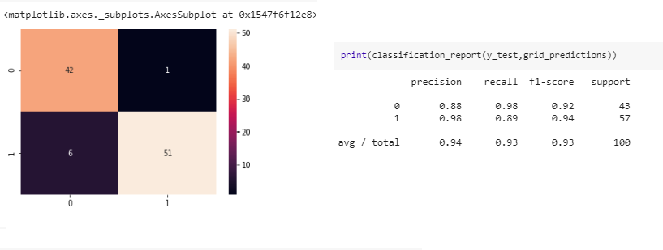
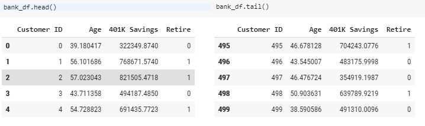
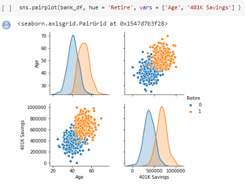
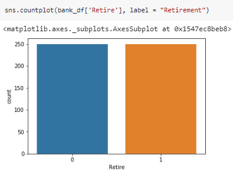
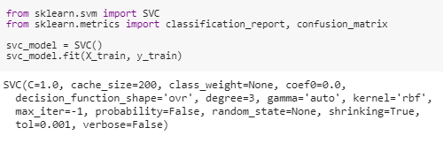
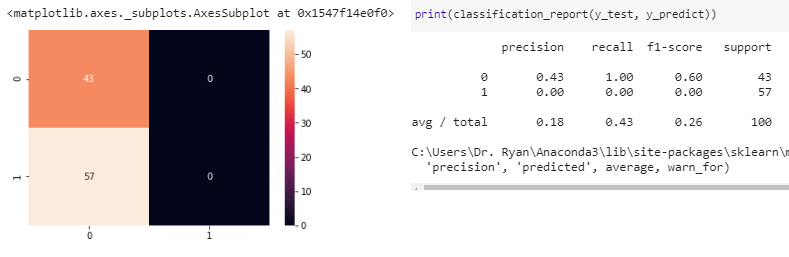
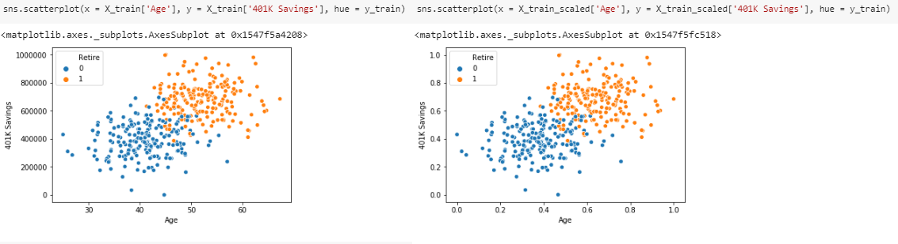

# Customer-Retirement--Prediction

# Background

#### BANK CUSTOMERS RETIREMENT PREDICTIONS USING SUPPORT VECTOR MACHINES

You work as a data scientist at a major bank in NYC and you have been tasked to develop a model that can predict whether a customer is able to retire or not based on his/her features. Features are his/her age and net 401K savings (retirement savings in the U.S.). You though that Support Vector Machines can be a great candidate to solve the problem.

# Goals

* IMPORTING DATA
* VISUALIZING THE DATA
* MODEL TRAINING
* EVALUATING THE MODEL
* IMPROVING THE MODEL

# How to run 

Open Google Colab https://colab.research.google.com/ and in the Navbar go to:
* File
* Upload Notebook
* Run the Cells

# Proccess

Import the data set and visualizing the properties
# 

With Pairgrid from Seaborn library, vizualizing the data points
#  

With .count function, vizualing false and positives input
#  

Transforming the data andSplinting into train and test
#  

Using Confusion Matrix to Evaluating the Model
#  

#### Improving the model
* Scalling X_train
* Visualing points for X_train
* Visualing points for X_train_Scalled
#  

#### Improving even more the model
* Importing Gridsearch  from Sklearn library
* Match best combinations to find the best parameters to the model
* Confusion Matrix with the result
#  

